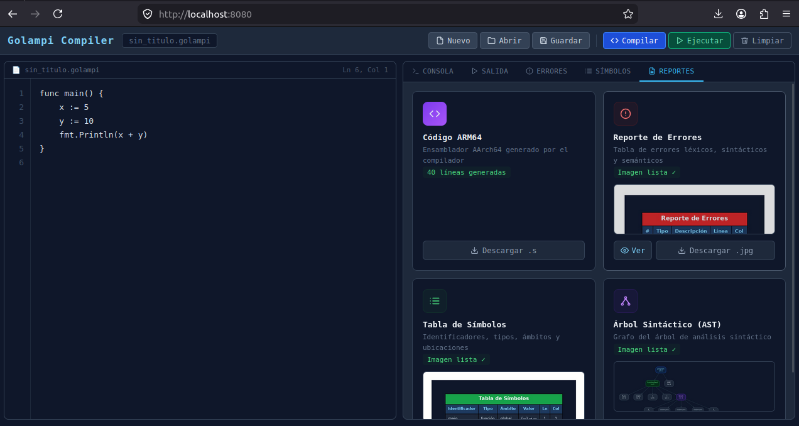
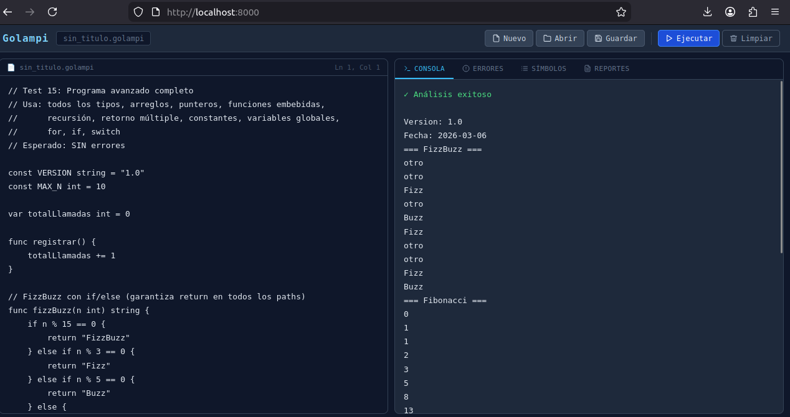

# Documentación Técnica — Proyecto 2
| Nombre | Carnet |
|--------|--------|
| Mariano Roberto Rac Noguera | 202101149 |

---

## Descripción General

Este proyecto es la continuación del Proyecto 1. Ahora el intérprete se convirtió en un compilador real: en lugar de ejecutar el árbol sintáctico directamente, el sistema genera código ensamblador ARM64 (AArch64) que puede ser ensamblado, enlazado y ejecutado en hardware ARM64 real o mediante emulación QEMU en x86.

El compilador sigue el pipeline clásico:

```
Código Golampi (.golampi)
    → Análisis léxico + sintáctico (ANTLR4)
    → Análisis semántico
    → Generación de código ARM64 (.s)
    → Ensamblado (aarch64-linux-gnu-as)
    → Enlace (aarch64-linux-gnu-gcc)
    → Ejecución (qemu-aarch64-static)
    → Salida del programa
```

Las tecnologías utilizadas son: **ANTLRv4** (PHP runtime), **PHP 8** para el backend, **HTML/CSS/JavaScript puro** para la interfaz, y **GNU Binutils + QEMU** para el pipeline de ejecución.

---

## 1. Gramática Formal (Golampi.g4)

La gramática no cambió respecto al Proyecto 1. Se documenta completa aquí como referencia.

### 1.1 Estructura del Programa

```antlr
program
    : (functionDecl | varDecl | constDecl)+ EOF
    ;
```

Un programa Golampi puede tener funciones, variables y constantes a nivel global. Al menos debe existir una función `main()`. Las constantes y variables globales se procesan antes de generar código de funciones.

**Ejemplo:**
```go
const MAX int32 = 100
const PI float32 = 3.14

func suma(a int32, b int32) int32 {
    return a + b
}

func main() {
    r := suma(10, 20)
    fmt.Println(r)
}
```

### 1.2 Declaraciones de Función

```antlr
functionDecl
    : FUNC ID '(' paramList? ')' returnType? block
    ;

paramList
    : param (',' param)*
    ;

param
    : ID type               // a int32
    | ID STAR type          // a *int32
    | ID STAR arrayType     // a *[5]int32
    | ID STAR sliceType     // a *[]int32
    | ID arrayType          // a [5]int32
    | ID sliceType          // a []int32
    ;

returnType
    : type
    | arrayType
    | sliceType
    | STAR type
    | STAR arrayType
    | STAR sliceType
    | '(' multiReturnType (',' multiReturnType)* ')'
    ;
```

El lenguaje soporta **hoisting**: todas las funciones se registran en una primera pasada antes de generar código, por lo que una función puede ser llamada antes de su definición textual.

**Función simple:**
```go
func cuadrado(x int32) int32 {
    return x * x
}
```

**Múltiples valores de retorno:**
```go
func dividir(a int32, b int32) (int32, bool) {
    if b == 0 {
        return 0, false
    }
    return a / b, true
}
```

**Parámetro puntero a arreglo:**
```go
func sortRef(a *[5]int32) {
    for i := 0; i < 5; i++ {
        for j := 0; j < 4; j++ {
            if a[j] > a[j+1] {
                temp := a[j]
                a[j] = a[j+1]
                a[j+1] = temp
            }
        }
    }
}
```

### 1.3 Variables y Constantes

```antlr
varDecl
    : VAR ID type ('=' expression)? ';'?
    | VAR idList type '=' expList ';'?
    | VAR ID arrayType ('=' arrayLiteral)? ';'?
    | VAR ID arrayType '=' expression ';'?
    | VAR ID STAR type ';'?
    | VAR ID STAR arrayType ';'?
    ;

varShortDecl
    : idList ':=' expList ';'?
    | ID ':=' arrayLiteral ';'?
    ;

constDecl
    : CONST ID type '=' expression ';'?
    ;
```

**Ejemplos:**
```go
var x int32 = 10           // variable con valor inicial
var y int32                // valor por defecto: 0
var w, z int32 = 1, 2      // múltiples variables
z := 42                    // declaración corta (infiere int32)
b := [3]int32{1, 2, 3}    // declaración corta con literal de arreglo
const MAX int32 = 100      // constante global
```

### 1.4 Tipos de Datos

| Tipo | Descripción | Valor por defecto |
|------|-------------|-------------------|
| `int32` | Entero con signo de 32 bits | `0` |
| `float32` | Punto flotante IEEE-754 de 32 bits | `0.0` |
| `bool` | Booleano lógico | `false` |
| `rune` | Alias de `int32`, representa un carácter Unicode | `0` |
| `string` | Cadena de texto | `""` |

```antlr
arrayType
    : '[' INT ']' type
    | '[' INT ']' arrayType     // para arrays multidimensionales
    ;
```

**Arrays:**
```go
var nums [5]int32                              // 1D, sin inicializar
var mat [2][3]int32 = [2][3]int32{{1,2,3},{4,5,6}}   // 2D inicializada
```

**Punteros:**
```go
func incrementar(p *int32) {
    *p = *p + 1
}
func main() {
    x := 10
    incrementar(&x)     // &x pasa la dirección de x
    fmt.Println(x)      // imprime 11
}
```

### 1.5 Control de Flujo

#### If / Else

```antlr
ifStmt
    : IF expression block (ELSE (ifStmt | block))?
    ;
```

El `else if` se modela como un `else` que contiene otro `if`. No se permiten paréntesis en la condición.

#### For (tres formas)

```antlr
forStmt
    : FOR forInit ';' expression ';' forPost block   // clásico
    | FOR expression block                            // estilo while
    | FOR block                                       // infinito
    ;
```

```go
for i := 0; i < 5; i++ { fmt.Println(i) }   // clásico
for x > 0 { x-- }                             // while
for { break }                                  // infinito con break
```

#### Switch

```antlr
switchStmt
    : SWITCH expression '{' caseClause* defaultClause? '}'
    ;

caseClause
    : CASE expList ':' statement*
    ;
```

Un `case` puede tener múltiples valores separados por coma. El `break` es implícito (no hay fallthrough).

```go
switch dia {
case 1:
    fmt.Println("Lunes")
case 2, 3:
    fmt.Println("Martes o Miercoles")
default:
    fmt.Println("Otro dia")
}
```

#### Break, Continue, Return

```antlr
breakStmt    : BREAK ';'? ;
continueStmt : CONTINUE ';'? ;
returnStmt   : RETURN expList? ';'? ;
```

### 1.6 Operadores

#### Aritméticos

| Operador | Descripción | Tipos válidos |
|----------|-------------|---------------|
| `+` | Suma | int32, float32, rune |
| `-` | Resta | int32, float32, rune |
| `*` | Multiplicación | int32, float32, rune |
| `/` | División entera / flotante | int32, float32, rune |
| `%` | Módulo | int32, rune |

#### Relacionales y Lógicos

| Operador | Resultado |
|----------|-----------|
| `==`, `!=`, `<`, `<=`, `>`, `>=` | `bool` |
| `&&`, `\|\|` | `bool` (con **evaluación de cortocircuito**) |
| `!` | `bool` |

Los operadores `&&` y `||` implementan cortocircuito obligatorio:
- `a && b`: si `a` es `false`, `b` no se evalúa
- `a || b`: si `a` es `true`, `b` no se evalúa

#### Asignación

```antlr
assignOp : '=' | '+=' | '-=' | '*=' | '/=' ;
incDecStmt : ID '++' ';'? | ID '--' ';'? ;
```

### 1.7 Funciones Embebidas

| Función | Descripción | Retorno |
|---------|-------------|---------|
| `fmt.Println(...)` | Imprime args separados por espacio + `\n` | — |
| `len(x)` | Longitud de arreglo o string | `int32` |
| `substr(s, ini, len)` | Subcadena desde `ini` con longitud `len` | `string` |
| `now()` | Fecha y hora actual (`YYYY-MM-DD HH:MM:SS`) | `string` |
| `typeOf(x)` | Nombre del tipo de `x` en tiempo de compilación | `string` |

```go
var s string = "Compiladores"
fmt.Println(len(s))          // 12
fmt.Println(substr(s, 0, 4)) // Comp
fmt.Println(typeOf(s))       // string
fmt.Println(now())           // 2026-04-27 15:30:00
```

### 1.8 Tokens Léxicos

```antlr
// Operadores compuestos (antes que simples para evitar conflictos)
ADD_ASSIGN : '+=' ;  SUB_ASSIGN : '-=' ;
MUL_ASSIGN : '*=' ;  DIV_ASSIGN : '/=' ;
OR : '||' ;  AND : '&&' ;  EQ : '==' ;  NEQ : '!=' ;
GTE : '>=' ; LTE : '<=' ;

// Palabras clave (deben preceder a ID en el orden léxico)
FUNC : 'func' ;  VAR : 'var' ;  CONST : 'const' ;
IF : 'if' ;  ELSE : 'else' ;  FOR : 'for' ;
SWITCH : 'switch' ;  CASE : 'case' ;  DEFAULT : 'default' ;
BREAK : 'break' ;  CONTINUE : 'continue' ;  RETURN : 'return' ;

// Identificadores (Unicode: letras, dígitos, guion bajo)
ID : [\p{L}_] [\p{L}\p{N}_]* ;

// Literales (FLOAT antes que INT para evitar ambigüedad)
FLOAT  : [0-9]+ '.' [0-9]+ ;
INT    : [0-9]+ ;
STRING : '"' ( '\\' . | ~["\\] )* '"' ;
RUNE   : '\'' ( '\\' . | ~['\\] ) '\'' ;

// Ignorados
LINE_COMMENT  : '//' ~[\r\n]* -> skip ;
BLOCK_COMMENT : '/*' .*? '*/' -> skip ;
WS            : [ \t\r\n]+ -> skip ;
```

---

## 2. Arquitectura del Compilador

### 2.1 Diagrama de Clases y Flujo

```
CÓDIGO FUENTE (.golampi)
        │
        ▼
┌────────────────────┐
│   GolampiLexer     │  Generado por ANTLR4
│   (tokenización)   │  → tokens, errores léxicos
└─────────┬──────────┘
          │
          ▼
┌────────────────────┐
│   GolampiParser    │  Generado por ANTLR4
│   (AST)            │  → árbol sintáctico, errores sintácticos
└────┬──────────┬────┘
     │          │
     ▼          ▼
┌──────────┐  ┌─────────────────────┐
│ Report   │  │  SemanticVisitor    │  Análisis semántico:
│ Generator│  │  + SymbolTable      │  - tipos, scopes, consts
│ (AST JPG)│  │  + VariableSymbol   │  - declaraciones previas
└──────────┘  │  + FunctionSymbol   │  - validaciones
              └──────────┬──────────┘
                         │
              ┌──────────┴──────────┐
              │                     │
              ▼                     ▼
     ┌────────────────┐    ┌─────────────────┐
     │ ReportGenerator│    │ ARM64Generator  │  ← NUEVO en P2
     │ errorsJpg      │    │ (compilador)    │
     │ symbolsJpg     │    └────────┬────────┘
     └────────────────┘             │
                                    ▼
                           CÓDIGO ARM64 (.s)
                                    │
                                    ▼
                         ┌──────────────────┐
                         │  execute.php     │  Pipeline QEMU
                         │  as → gcc → qemu │
                         └──────────────────┘
                                    │
                                    ▼
                            SALIDA DEL PROGRAMA
```

### 2.2 Descripción de Componentes

#### GolampiLexer / GolampiParser
Generados automáticamente por ANTLR4 a partir de `Golampi.g4`. El lexer convierte el código fuente en tokens; el parser construye el árbol sintáctico abstracto (AST). Ambos reportan errores a través de un `ErrorListener` personalizado (`GolampiErrorListener`) que los formatea en JSON para la interfaz.

#### SemanticVisitor
Recorre el AST con el patrón Visitor y realiza el análisis semántico. Valida:
- Tipos compatibles en asignaciones, operaciones y retornos
- Variables declaradas antes de ser usadas
- Constantes no reasignadas
- Operaciones válidas por tipo (por ejemplo, `%` no aplica a float32)
- Tipos `rune` e `int32` son compatibles entre sí (rune es alias de int32)

Usa una pila de scopes para manejar visibilidad léxica. Al salir de un bloque, las variables locales dejan de ser visibles.

#### SymbolTable
Estructura de pila de scopes. Cada scope es un mapa `nombre → símbolo`. La resolución de una variable busca desde el scope más interno hacia el global.

```php
// Búsqueda de variable "x":
// scope actual → scope padre → ... → scope global
// Si no se encuentra → error semántico
```

#### ARM64Generator *(nuevo en P2)*
El corazón del proyecto. Implementa `GolampiBaseVisitor` y genera código ensamblador AArch64 (GAS syntax). Se explica en detalle en la sección 3.

#### ReportGenerator
Genera imágenes JPG (codificadas en base64) para tres reportes:
- Árbol AST (grafo de análisis sintáctico)
- Tabla de errores (léxicos, sintácticos, semánticos)
- Tabla de símbolos (variables y funciones con tipos y scopes)

#### execute.php *(nuevo en P2)*
Endpoint PHP que recibe el código ARM64 generado, lo ensambla y ejecuta mediante el pipeline cross-compilation:
1. `aarch64-linux-gnu-as` — ensambla `.s` → `.o`
2. `aarch64-linux-gnu-gcc` — enlaza `.o` → ejecutable ELF ARM64
3. `qemu-aarch64-static -L /usr/aarch64-linux-gnu` — emula y ejecuta

Maneja timeouts de 10 segundos, señales de segfault, y el caso de herramientas no instaladas.

---

## 3. Generación de Código ARM64

Esta es la parte más importante del Proyecto 2. El `ARM64Generator` traduce cada construcción del lenguaje a instrucciones AArch64 con sintaxis GAS (GNU Assembler).

### 3.1 Convenciones de Llamada y Frame Layout

Cada función usa un **frame fijo de 496 bytes** en el stack. Elegí un tamaño fijo para simplificar la implementación — es más que suficiente para la mayoría de programas y evita tener que calcular el tamaño exacto del frame en tiempo de compilación.

```
Stack frame (x29 = frame pointer):
┌────────────────────────────────┐  ← sp (antes del prólogo)
│  [x29 + 0]  = saved x29 (fp)  │
│  [x29 + 8]  = saved x30 (lr)  │
│  [x29 + 16] = variable 1       │  ← primera variable local
│  [x29 + 24] = variable 2       │
│  [x29 + 32] = variable 3       │
│  ...                           │
│  [x29 + N]  = variable N       │
└────────────────────────────────┘  ← sp - 496
```

**Prólogo:**
```asm
stp  x29, x30, [sp, #-496]!   ; guardar fp y lr, decrementar sp
mov  x29, sp                   ; establecer frame pointer
```

**Epílogo:**
```asm
.Lfuncname_ret:
    mov  w0, #0                ; solo en main: exit code 0
    mov  sp, x29               ; restaurar sp
    ldp  x29, x30, [sp], #496  ; restaurar fp y lr (496 ≤ 504, límite del ldp)
    ret
```

El límite de 504 en el post-index del `ldp` es una restricción del ISA AArch64: el inmediato del post-index es un campo de 7 bits con signo, escalado por 8, dando un rango de -512 a +504.

### 3.2 Variables y Tipos

Cada variable tiene un slot en el frame. El `nextOffset` empieza en 16 y avanza de 8 en 8 bytes por variable (incluso para int32 y float32, se reservan 8 bytes para mantener el stack alineado a 8 bytes).

| Tipo | Tamaño real | Instrucción de carga | Instrucción de store |
|------|-------------|---------------------|---------------------|
| `int32` / `bool` / `rune` | 4 bytes | `ldr w0, [x29, #off]` | `str w0, [x29, #off]` |
| `string` | 8 bytes (puntero) | `ldr x0, [x29, #off]` | `str x0, [x29, #off]` |
| `float32` | 4 bytes (IEEE-754) | `ldr s0, [x29, #off]` / `fmov w0, s0` | `fmov s0, w0` / `str s0, [x29, #off]` |
| `ptr:T` | 8 bytes (dirección) | `ldr x0, [x29, #off]` | `str x0, [x29, #off]` |
| `array` | N × elemSize | `add x0, x29, #off` | — (in-place) |

Los arrays se alocan en el frame reservando `totalElems × elemSize` bytes consecutivos. El acceso a `arr[i]` calcula `base + i * elemSize` en tiempo de ejecución.

### 3.3 Paso de Parámetros

Se usan hasta 8 registros para argumentos (x0–x7, o w0–w7 para enteros de 32 bits). Los argumentos se evalúan, se guardan en el stack temporalmente, y luego se cargan en los registros en orden inverso:

```asm
; llamada a suma(a, b):
ldr  w0, [x29, #off_a]   ; evaluar a → w0
sxtw x0, w0
str  x0, [sp, #-16]!     ; push
ldr  w0, [x29, #off_b]   ; evaluar b → w0
sxtw x0, w0
str  x0, [sp, #-16]!     ; push
ldr  x1, [sp], #16       ; pop → x1 (b)
ldr  x0, [sp], #16       ; pop → x0 (a)
bl   suma
```

Para **arrays pasados como argumentos**, se pasa la **dirección** del array (no una copia): `add x0, x29, #off_array`. Dentro de la función que recibe `a [5]int32`, el parámetro se trata internamente como `*[5]int32` (puntero), lo que permite acceder y modificar los elementos del array original. Esto hace que `nums1 = sort(nums1)` funcione: `sort` modifica los elementos en su lugar a través de la dirección recibida.

### 3.4 Expresiones Aritméticas

El resultado de cualquier expresión queda en `w0` (para enteros/bool/rune) o `x0` (para strings/punteros). Para operaciones binarias se usa el stack como almacenamiento temporal del operando izquierdo:

```asm
; x + y  (int32)
ldr  w0, [x29, #off_x]   ; evaluar x → w0
str  w0, [sp, #-16]!      ; guardar x en stack
ldr  w0, [x29, #off_y]   ; evaluar y → w0
ldr  w1, [sp], #16        ; recuperar x → w1
add  w0, w1, w0           ; x + y → w0
```

### 3.5 Punto Flotante (float32)

Los valores `float32` se transportan en `w0` como bits IEEE-754 crudos. Cuando se necesita hacer aritmética flotante, se activa el modo float (`floatDepth > 0`) que indica al generador usar los registros FPU `s0`/`s1`:

```asm
; x + y  (float32)
ldr  s0, [x29, #off_x]   ; cargar float32 desde memoria
fmov w0, s0               ; mover bits a w0 (transporte)
str  w0, [sp, #-16]!      ; guardar en stack
ldr  s0, [x29, #off_y]
fmov w0, s0
ldr  w1, [sp], #16
fmov s1, w1               ; recuperar operando izquierdo como float
fmov s0, w0               ; operando derecho como float
fadd s0, s1, s0           ; suma flotante
fmov w0, s0               ; resultado → w0 (bits IEEE-754)
```

Para `fmt.Println` con float32, se convierte a double antes de la llamada variadic de printf:
```asm
fmov s0, w0     ; w0 tiene los bits del float32
fcvt d0, s0    ; convertir a double (64 bits)
fmov x0, d0    ; mover bits del double a x0 para la llamada variadic
```

### 3.6 Evaluación de Cortocircuito

Los operadores `&&` y `||` generan saltos condicionales que evitan evaluar el segundo operando si el primero ya determina el resultado:

**Operador `&&`:**
```asm
; flag && esValido(10)
<evaluar flag> → w0
cbz  w0, .Land_false    ; si flag == 0, saltar (cortocircuito)
<evaluar esValido(10)> → w0
b    .Land_end
.Land_false:
    mov  w0, #0
.Land_end:
```

**Operador `||`:**
```asm
; x || y
<evaluar x> → w0
cbnz w0, .Lor_true      ; si x != 0, saltar (cortocircuito)
<evaluar y> → w0
b    .Lor_end
.Lor_true:
    mov  w0, #1
.Lor_end:
```

### 3.7 Arreglos N-dimensionales

**Arreglo 1D:** los elementos se almacenan contiguamente en el frame. El acceso `arr[i]` calcula:
```
dirección_elemento = base + i * elemSize
```

**Arreglo 2D `[rows][cols]T`:** el acceso `mat[i][j]` calcula:
```
dirección_elemento = base + i * (cols * elemSize) + j * elemSize
```

**Arreglo 3D `[d0][d1][d2]T`:** el acceso `cubo[k][i][j]` calcula:
```
dirección_elemento = base + k*(d1*d2*elemSize) + i*(d2*elemSize) + j*elemSize
```

En general, para un arreglo N-dimensional `[d0][d1]...[dN-1]T`, el stride del índice `k` es:
```
stride_k = elemSize * d_{k+1} * d_{k+2} * ... * d_{N-1}
```

Los strides y dimensiones se obtienen en tiempo de compilación desde `$arrayInfo`. Los índices siempre se evalúan en contexto entero (fuera de `floatDepth`), garantizando que `sxtw` reciba valores enteros correctos.

**Retorno de arreglo por valor:** cuando una función retorna un arreglo (p.ej. `[2]int32`), el callee aloca el arreglo en su propio frame y retorna su dirección en `x0`. El caller copia todos los elementos inmediatamente tras `bl` antes de cualquier otra llamada, para evitar lecturas de memoria liberada:

```asm
bl   reglaCramer
ldr  w1, [x0, #0]        ; copiar elemento 0
str  w1, [x29, #off]
ldr  w1, [x0, #4]        ; copiar elemento 1
str  w1, [x29, #off+4]
```

### 3.8 Múltiples Valores de Retorno

Para funciones con dos valores de retorno (por ejemplo, `(int32, bool)`), el primer valor se retorna en `w0` y el segundo en `x1`:

```asm
; return a / b, true
<evaluar a/b> → w0
str  x0, [sp, #-16]!    ; guardar primer valor
mov  w0, #1             ; true
mov  x1, x0             ; segundo valor → x1
ldr  x0, [sp], #16      ; primer valor → x0
b    .Lfuncion_ret
```

En el caller, al recibir `resultado, ok := dividir(10, 2)`:
- `resultado` ← `w0`
- `ok` ← `w1` (con `str w1, [x29, #off_ok]`)

### 3.9 Constantes Globales

Las constantes globales se recolectan antes de generar código de funciones. Dependiendo del tipo:
- `int32`/`bool`/`rune`: se emiten como inmediatos (`mov w0, #val`)
- `float32`: se emiten como `.float val` en la sección `.data`
- `string`: se emiten como `.string "val"` en la sección `.data`

Cuando se referencia una constante en una expresión, el generador emite el valor inline sin ocupar slot en el frame.

### 3.10 Punteros Escalares — Auto-Desreferencia

Los parámetros declarados como puntero a tipo escalar (`*int32`, `*float32`, `*bool`) permiten modificar el valor original desde dentro de la función. El compilador aplica **auto-desreferencia** automáticamente:

- **Lectura** (`genPrimary`): carga el puntero con `ldr x0, [x29, #off]` y luego desreferencia `ldr w0, [x0]`, poniendo el valor apuntado en `w0`.
- **Escritura** (`storeVar`): carga el puntero con `ldr x1, [x29, #off]` y almacena el nuevo valor con `str w0, [x1]`, escribiendo a través del puntero.

Esta auto-desreferencia solo aplica para `ptr:T` donde `T` **no** es un arreglo (se excluye `ptr:[N]T`), ya que los arreglos se pasan por referencia implícita y no necesitan este mecanismo.

```asm
; temp := *x  (auto-deref en lectura)
ldr  x0, [x29, #off_x]   ; cargar puntero
ldr  w0, [x0]             ; desreferenciar → valor en w0

; *x = *y  (auto-deref en escritura)
ldr  w0, [x29_y]          ; valor nuevo en w0
ldr  x1, [x29, #off_x]   ; cargar puntero destino
str  w0, [x1]             ; escribir a través del puntero
```

### 3.11 Manejo de nil

`nil` en Golampi representa un valor nulo para punteros y strings. El compilador lo maneja de dos formas:

- **Impresión de nil** (`fmt.Println(ptrVar)`): cuando la variable contiene el valor cero (`0x0`), se imprime la cadena `<nil>`.
- **Comparación `nil == nil`**: el compilador detecta que ambos operandos son el literal `nil` y emite directamente la dirección del string `<nil>` en `x0`, sin realizar comparación de punteros en tiempo de ejecución. Esto es necesario porque cada literal `nil` se almacena en una etiqueta diferente en `.data`.

### 3.12 Conversión Implícita int32 → float32

Cuando una variable entera se usa en contexto float (p.ej. dentro de `genArrayAssign` con `elemType=float32`), el compilador emite una conversión explícita con `scvtf` antes de realizar la operación aritmética flotante:

```asm
ldr  w0, [x29, #off_suma]   ; cargar entero
scvtf s0, w0                 ; convertir int32 → float32
fmov w0, s0                  ; float bits en w0 para operaciones uniformes
```

Esto garantiza que expresiones como `suma / 2.0` (con `suma` de tipo `int32`) produzcan el resultado flotante correcto en lugar de interpretar los bits del entero como IEEE 754.

Los índices de arreglo siempre se evalúan **fuera** del contexto flotante (suspendiendo `floatDepth` temporalmente) para que `sxtw` reciba un entero puro y no bits de float.

### 3.13 Funciones Embebidas

| Función | Implementación ARM64 |
|---------|---------------------|
| `fmt.Println(...)` | Construye string de formato (`%d`, `%s`, `%f`) dinámicamente, llama a `printf` de libc |
| `len(arr)` | Para arreglos: constante en compile-time. Para strings: llama a `strlen` de libc |
| `substr(s, i, n)` | Llama a `strndup(s+i, n)` de libc |
| `now()` | Llama a `time()` → `localtime()` → `strftime()` |
| `typeOf(x)` | En compile-time: emite dirección de literal string con el nombre del tipo |

### 3.14 Ejemplo Completo de Salida

Para el programa:
```go
func main() {
    x := 5
    y := 10
    fmt.Println(x + y)
}
```

El generador produce aproximadamente:
```asm
.section .data
.Lstr0:
    .string "%d\n"

.section .text
.global main
main:
    stp  x29, x30, [sp, #-496]!
    mov  x29, sp
    mov  w0, #5
    str  w0, [x29, #16]        ; x = 5
    mov  w0, #10
    str  w0, [x29, #24]        ; y = 10
    ldr  w0, [x29, #16]        ; cargar x
    str  w0, [sp, #-16]!
    ldr  w0, [x29, #24]        ; cargar y
    ldr  w1, [sp], #16
    add  w0, w1, w0             ; x + y
    sxtw x0, w0
    str  x0, [sp, #-16]!
    adrp x8, .Lstr0
    add  x8, x8, :lo12:.Lstr0
    ldr  x1, [sp], #16
    mov  x0, x8
    bl   printf                 ; printf("%d\n", 15)
.Lmain_ret:
    mov  w0, #0                 ; exit code 0
    mov  sp, x29
    ldp  x29, x30, [sp], #496
    ret
```

---

## 4. Interfaz Gráfica (GUI)

La GUI es una aplicación web de una sola página construida con HTML, CSS y JavaScript puro (sin frameworks).

### 4.1 Layout General



La pantalla se divide en dos paneles:
- **Panel izquierdo**: editor de código con numeración de líneas y posición del cursor
- **Panel derecho**: pestañas de salida (Consola, Salida, Errores, Símbolos, Reportes)

### 4.2 Toolbar

| Botón | Acción | Atajo |
|-------|--------|-------|
| Nuevo | Limpia el editor con código de ejemplo | — |
| Abrir | Carga un archivo `.golampi` desde disco | — |
| Guardar | Descarga el código actual como archivo | — |
| **Compilar** | Envía el código al backend, genera ARM64 | `Ctrl+Enter` |
| **Ejecutar** | Ensambla y ejecuta via QEMU el ARM64 generado | `Ctrl+Shift+Enter` |
| Limpiar | Borra las consolas de salida | — |

El botón **Ejecutar** está deshabilitado hasta que se realiza una compilación exitosa.

### 4.3 Pestañas de Salida

**Consola — Código ARM64 Generado**
Muestra el ensamblador generado con fuente monoespaciada. Se actualiza cada vez que se compila.

**Salida — Resultado de la Ejecución**
Muestra la salida estándar del programa al ejecutarlo via QEMU. Los errores de ensamblado, enlace o ejecución se muestran en rojo. La salida normal en verde.

**Errores**
Lista de errores léxicos, sintácticos y semánticos con tipo, línea y columna. Un badge numérico en la pestaña indica la cantidad de errores.

**Símbolos**
Tabla con todas las variables y funciones encontradas: nombre, tipo, scope, línea de declaración.

**Reportes**
Cuatro tarjetas con acciones de descarga y previsualización:
- Código ARM64 → descargar `.s`
- Reporte de errores → previsualizar / descargar JPG
- Tabla de símbolos → previsualizar / descargar JPG
- Árbol sintáctico (AST) → previsualizar / descargar JPG

### 4.4 Flujo de Uso



1. El usuario escribe o carga un programa `.golampi`
2. Presiona **Compilar** (o `Ctrl+Enter`)
3. El frontend hace `POST /analyze.php` con `{"code": "..."}`
4. El backend responde con `{arm64_code, errors, symbols, img_ast, img_errors, img_symbols}`
5. Si la compilación fue exitosa, se habilita **Ejecutar**
6. Al presionar **Ejecutar**, el frontend hace `POST /execute.php` con `{"arm64_code": "..."}`
7. El backend ensambla, enlaza y ejecuta con QEMU, respondiendo con `{output, error, exit_code}`
8. La pestaña **Salida** muestra el resultado

---

## 5. Pipeline de Ejecución (QEMU)

El archivo `execute.php` implementa el pipeline completo de cross-compilación y emulación:

```php
// 1. Verificar herramientas instaladas
aarch64-linux-gnu-as     // ensamblador cross
aarch64-linux-gnu-gcc    // compilador/linker cross (enlaza con libc ARM64)
qemu-aarch64-static      // emulador ARM64

// 2. Escribir .s en /tmp
file_put_contents("/tmp/gol_HASH.s", $arm64_code);

// 3. Ensamblar: .s → .o
exec("aarch64-linux-gnu-as -o gol.o gol.s");

// 4. Enlazar con libc ARM64: .o → ejecutable ELF
exec("aarch64-linux-gnu-gcc -o gol gol.o");

// 5. Ejecutar con timeout y sysroot
exec("timeout 10 qemu-aarch64-static -L /usr/aarch64-linux-gnu ./gol");

// 6. Limpiar archivos temporales
```

### ¿Por qué QEMU?

El compilador genera código AArch64 (ARM64). Las máquinas de desarrollo típicamente corren x86_64, que es una arquitectura completamente distinta. QEMU es un emulador que puede ejecutar binarios ARM64 en x86_64 traduciendo las instrucciones en tiempo de ejecución.

Para instalarlo en Ubuntu/Debian:
```bash
sudo apt-get install gcc-aarch64-linux-gnu qemu-user-static
```

---

## 6. Archivos del Proyecto

```
golampi/
├── grammar/
│   ├── Golampi.g4              Especificación ANTLR4
│   ├── GolampiLexer.php        Tokenizador (generado)
│   ├── GolampiParser.php       Parser / AST (generado)
│   ├── GolampiVisitor.php      Interfaz Visitor (generado)
│   └── GolampiBaseVisitor.php  Implementación base (generado)
├── semantic/
│   ├── SemanticVisitor.php     Análisis semántico
│   ├── SymbolTable.php         Gestión de scopes y símbolos
│   ├── VariableSymbol.php      Símbolo de variable
│   ├── FunctionSymbol.php      Símbolo de función
│   └── Reportgenerator.php     Generador de reportes JPG
├── compiler/
│   └── ARM64Generator.php      Generador de código ARM64 ← NUEVO
├── public/
│   ├── index.php               Interfaz web (HTML)
│   ├── script.js               Lógica del frontend
│   ├── styles.css              Estilos
│   ├── analyze.php             Endpoint: compilar → ARM64
│   └── execute.php             Endpoint: ARM64 → QEMU → output ← NUEVO
└── vendor/
    └── antlr/antlr4-php-runtime   Runtime de ANTLR4 para PHP
```

---

## 7. Casos de Prueba

Los siguientes programas se compilaron y ejecutaron exitosamente via QEMU:

### Ordenamiento por referencia (ejemplo del PDF)
```go
func sortRef(a *[5]int32) {
    for i := 0; i < 5; i++ {
        for j := 0; j < 4; j++ {
            if a[j] > a[j+1] {
                temp := a[j]
                a[j] = a[j+1]
                a[j+1] = temp
            }
        }
    }
}
func main() {
    nums := [5]int32{5, 3, 4, 1, 2}
    sortRef(&nums)
    fmt.Println(nums[0], nums[1], nums[2], nums[3], nums[4])
}
// Output: 1 2 3 4 5
```

### Múltiples valores de retorno
```go
func dividir(a int32, b int32) (int32, bool) {
    if b == 0 {
        return 0, false
    }
    return a / b, true
}
func main() {
    resultado, ok := dividir(10, 2)
    if ok {
        fmt.Println(resultado)
    }
}
// Output: 5
```

### Float32 con FPU
```go
func main() {
    var x float32 = 1.5
    var y float32 = 2.5
    var z float32 = x + y
    fmt.Println(z)
}
// Output: 4.000000
```

### Cortocircuito
```go
func main() {
    flag := false
    if flag && true {
        fmt.Println("no deberia imprimir")
    } else {
        fmt.Println("cortocircuito funciona")
    }
}
// Output: cortocircuito funciona
```

### Funciones embebidas
```go
func main() {
    var s string = "Compiladores"
    fmt.Println(len(s))
    fmt.Println(substr(s, 0, 4))
    fmt.Println(typeOf(s))
}
// Output:
// 12
// Comp
// string
```

---

**Autor:** Mariano Roberto Rac Noguera  
**Carnet:** 202101149  
**Curso:** Organización de Lenguajes y Compiladores 2 — 1er Semestre 2026
