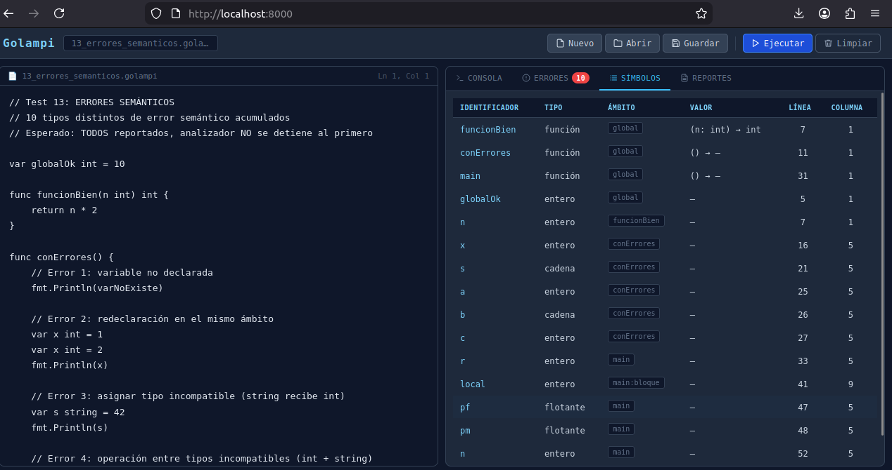
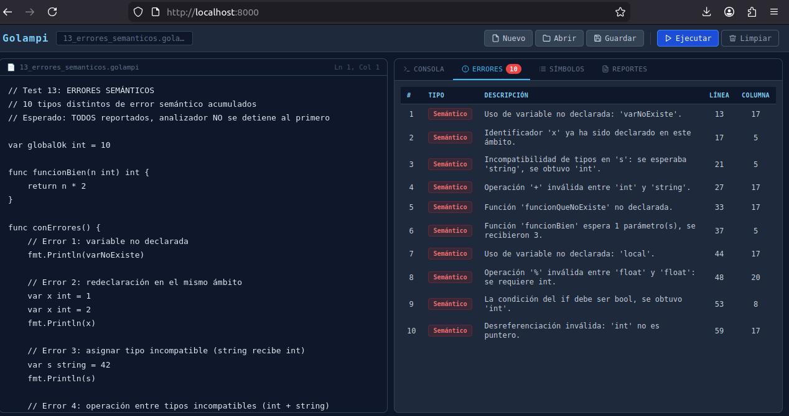
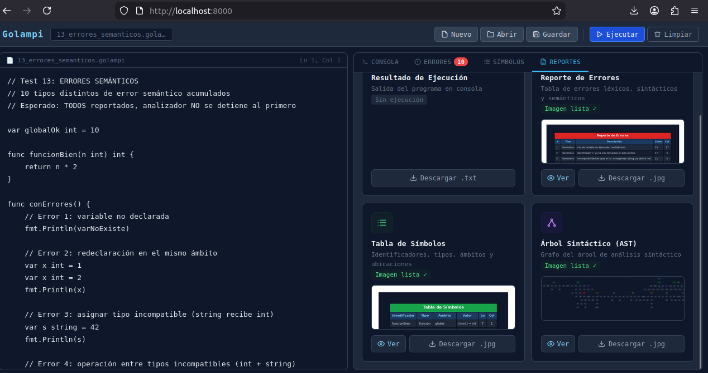

# Manual de Usuario - Golampi Interpreter
| Nombre | Carnet|
|----------|-------|
| Mariano Roberto Rac Noguera| 202101149 |

## Índice
1. [Requisitos del Sistema](#requisitos-del-sistema)
2. [Instalación](#instalación)
3. [Inicio del Servidor](#inicio-del-servidor)
4. [Interfaz de Usuario](#interfaz-de-usuario)
5. [Crear, Editar y Ejecutar Código](#crear-editar-y-ejecutar-código)
6. [Interpretación de Reportes](#interpretación-de-reportes)

---

## Requisitos del Sistema

Antes de instalar y usar Golampi, asegúrate de tener lo siguiente:

### Software Obligatorio

| Componente | Versión Mínima | Descripción |
|-----------|-----------------|-------------|
| **PHP** | 7.4+ | Lenguaje de programación backend |
| **Composer** | 2.0+ | Gestor de dependencias PHP |
| **PHP CLI** | 7.4+ | Interfaz de línea de comandos de PHP |

### Navegador Web

Se recomienda usar navegadores modernos:
- Chrome/Chromium 90+
- Firefox 88+
- Safari 14+
- Edge 90+

### Requisitos del Equipo

- **RAM**: Mínimo 512 MB
- **Disco**: 200 MB de espacio libre
- **Conexión**: Localhost

---

## Instalación

### Paso 1: Instalar PHP y Composer

#### En Ubuntu/Debian:
```bash
sudo apt update
sudo apt install php php-cli php-json php-mbstring composer
php -v
composer -v
```

#### En Windows:
1. Descargar PHP desde https://www.php.net/downloads.php
2. Descargar Composer desde https://getcomposer.org/
3. Ejecutar instaladores
4. Verificar en CMD:
```cmd
php -v
composer -v
```

#### En macOS:
```bash
brew install php composer
php -v
composer -v
```

### Paso 2: Descargar el Proyecto Golampi

**Con Git:**
```bash
git clone <url-del-repositorio>
cd OLC2_1S2026_P1_202101149/golampi
```

**O descargar directamente:**
1. Descargar archivo ZIP
2. Extraer en carpeta deseada
3. Abrir terminal en la carpeta `golampi/`

### Paso 3: Instalar Dependencias

```bash
cd /ruta/a/golampi
composer install
```

### Verificación de Instalación

```bash
ls -la vendor/
ls vendor/antlr/
```

---

## Inicio del Servidor

### Comando para Iniciar

```bash
php -S localhost:8000 -t public
```

**Parámetros:**

| Parámetro | Significado |
|-----------|-------------|
| `php` | Comando de PHP |
| `-S` | Iniciar servidor web integrado |
| `localhost:8000` | Host:Puerto |
| `-t public` | Directorio raíz del servidor |

### Pasos para Iniciar

1. Abrir terminal
2. Navegar a la carpeta del proyecto:
   ```bash
   cd /path/to/golampi
   ```
3. Ejecutar:
   ```bash
   php -S localhost:8000 -t public
   ```
4. Resultado esperado:
   ```
   Development Server (PHP 7.4.3)
   Listening on http://localhost:8000
   Press Ctrl+C to quit
   ```

### Acceder a la Aplicación

Abrir navegador web e ir a:
```
http://localhost:8000
```

### Detener el Servidor

Presionar `Ctrl+C` en la terminal

---

## Interfaz de Usuario

### Componentes Principales

```
┌──────────────────────────────────────────────────────────────────────┐
│                            HEADER                                    │
│  Golampi    [sin_titulo.golampi] [Ln 1, Col 1]   [Toolbar botones] │
├────────────────────────┬──────────────────────────────────────────┤
│                        │                                          │
│    EDITOR              │      PANEL DE PESTAÑAS                │
│    (código Golampi)    │    ┌───────┬───────┬───────┬──────────┐ │
│                        │    │Consola│Errores│Símbol.│ Reportes │ │
│                        │    └───────┴───────┴───────┴──────────┘ │
│                        │                                          │
│                        │     CONTENIDO DINÁMICO SEGÚN PESTAÑA    │
│                        │                                          │
└────────────────────────┴──────────────────────────────────────────┘
```

### Barra de Herramientas

| Botón | Función |
|-------|---------|
| **Nuevo** | Crear archivo nuevo en blanco |
| **Abrir** | Abrir archivo `.golampi` existente |
| **Guardar** | Guardar código a archivo local |
| **Ejecutar** | Compilar, analizar e interpretar código |
| **Limpiar** | Limpiar panel de consola |

### Paneles Principales

#### 1. Editor (Izquierda)
- Área de entrada de código Golampi
- Soporte para archivos `.golampi`, `.go` y `.txt`
- Numeración de líneas automática
- Indicador de posición del cursor (Ln X, Col Y)

#### 2. Pestaña "Consola"
- Salida de ejecución del programa
- Resultado de `println()`
- Inicial: "Listo"

#### 3. Pestaña "Errores"
- Lista de errores (Léxico, Sintáctico, Semántico)
- Línea y columna exacta del error
- Descripción legible en español
- Badge con contador de errores

#### 4. Pestaña "Símbolos"
- Tabla de símbolos (variables, funciones, constantes)
- Información: Nombre, Tipo, Scope, Valor
- Se actualiza después de cada ejecución

#### 5. Pestaña "Reportes"
- Panel con 4 tarjetas descargables:
  - Resultado de Ejecución (.txt)
  - Reporte de Errores (.jpg)
  - Tabla de Símbolos (.jpg)
  - Árbol Sintáctico (.jpg)

---

## Crear, Editar y Ejecutar Código

### 1. Crear un Archivo Nuevo

```
1. Clic en "Nuevo"
   → Se abre interfaz en blanco
2. Nombre: "sin_titulo.golampi"
   → Cambia cuando guardas
```

### 2. Escribir Código

Ejemplo básico:
```go
func main() {
    var x int = 10;
    var y int = 20;
    var suma int = x + y;
    println(suma);
}
```

### 3. Ejecutar el Código

**Opción A: Botón**
```
Clic en botón "Ejecutar" (play)
```

**Opción B: Atajo de teclado**
```
Ctrl + Enter
```

### 4. Guardar el Código

```
Clic en "Guardar"
→ Se descarga archivo .golampi
→ Nombre se actualiza en la interfaz
```

**Atajo:** `Ctrl+S`

### 5. Abrir Archivo Existente

```
1. Clic en "Abrir"
2. Seleccionar archivo .golampi o .go
3. Contenido se carga en el editor
4. Nombre se actualiza
```

### 6. Limpiar la Consola

```
Clic en "Limpiar"
→ Borra contenido del panel de consola
→ El código permanece en el editor
→ Los reportes siguen disponibles
```

---

## Interpretación de Reportes

### Panel de Reportes

Tras ejecutar código, accede a la pestaña "Reportes":

```
1. Clic en pestaña "Reportes"
   → Se abre panel con 4 tarjetas

2. Para cada reporte:
   a) Clic en "Ver" → Previsualización
   b) Clic en "Descargar" → Descargar archivo
```

### 1. Resultado de Ejecución

- **Contiene**: Salida completa del programa
- **Formato**: `.txt`
- **Acciones**: Descargar archivo

### 2. Reporte de Errores

- **Contiene**: Tabla visual de errores
- **Columnas**: Tipo, Descripción, Línea, Columna
- **Formato**: `.jpg`
- **Solo disponible si**: Hay errores
- **Badge**: Contador de errores

### 3. Tabla de Símbolos

- **Contiene**: Tabla de símbolos identificados
- **Columnas**: Identificador, Tipo, Ámbito, Valor, Línea, Columna
- **Formato**: `.jpg`
- **Actualiza**: Después de cada ejecución

### 4. Árbol Sintáctico (AST)

- **Contiene**: Grafo visual del árbol sintáctico
- **Formato**: `.jpg`
- **Siempre generado**: Incluso con errores sintácticos parciales

### Tabla de Símbolos - Interpretación

```
Nombre   │ Tipo      │ Scope  │ Valor
─────────┼───────────┼────────┼─────────────────────
x        │ int       │ main   │ 42
y        │ string    │ main   │ "Hola Mundo"
ptr      │ *int      │ main   │ (referencia a x)
arr      │ [5]int    │ global │ [1, 2, 3, 4, 5]
fibonacci│ func(int) │ global │ -
```

| Columna | Significado | Ejemplos |
|---------|-------------|----------|
| **Nombre** | Identificador | x, fibonacci |
| **Tipo** | Tipo de dato | int, string, *int, [5]float |
| **Ámbito** | Contexto de declaración | global, main, if_block |
| **Valor** | Valor actual o - | 42, "texto", - |

### Mensajes de Error Comunes

| Error | Causa | Solución |
|-------|-------|----------|
| "Variable no declarada: x" | Usar variable no creada | Declarar con `var x tipo;` |
| "Función no existe: foo" | Llamar función inexistente | Verificar nombre y declaración |
| "Tipo incompatible" | Asignar tipo incorrecto | Convertir o cambiar tipo |
| "Token no reconocido" | Carácter inválido | Usar caracteres válidos |
| "Se esperaba ';'" | Falta marca de fin | Agregar `;` al final |
| "Break/Continue fuera de bucle" | Usar fuera de loop | Envolver en for o switch |

---

## Capturas de Pantalla

### Pantalla 1: Interfaz Principal


### Pantalla 2: Ejecución Exitosa



### Pantalla 3: Tabla de Errores



### Pantalla 4: Árbol Sintáctico



---

## Atajos de Teclado

| Atajo | Función |
|-------|---------|
| **Ctrl+Enter** | Ejecutar código |
| **Ctrl+S** | Guardar archivo |
| **Ctrl+A** | Seleccionar todo |
| **Ctrl+Z** | Deshacer |
| **Tab** | Indentar línea |

---

## Solución de Problemas

### Servidor no inicia

**Problema:**
```bash
Error: Cannot find server configuration
```

**Soluciones:**

1. Verifica que estés en la carpeta correcta:
   ```bash
   cd /path/to/golampi
   ```

2. Verifica que exista la carpeta `public/`:
   ```bash
   ls -la public/
   ```

3. Si el puerto 8000 está en uso:
   ```bash
   php -S localhost:8001 -t public
   ```

### Página en blanco

**Síntoma:** Navegador muestra página en blanco

**Soluciones:**
1. Esperar 5 segundos a que cargue
2. Refrescar: F5 o Ctrl+R
3. Limpiar caché: Ctrl+Shift+Delete
4. Revisar consola: F12 → Console

### Código no ejecuta sin errores

**Verificar:**
1. Función `main()` existe:
   ```go
   func main() {
       println("Hola");
   }
   ```

2. Hay salida en el código
3. Caché del navegador (limpiar)

### "Composer command not found"

**En Linux/Mac:**
```bash
php /usr/local/bin/composer.phar install
```

**En Windows:**
- Reinstalar Composer
- Agregar a PATH

---

**Autor:** Mariano Roberto Rac Noguera  
**Carnet:** 202101149
